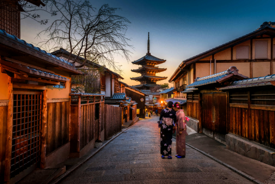
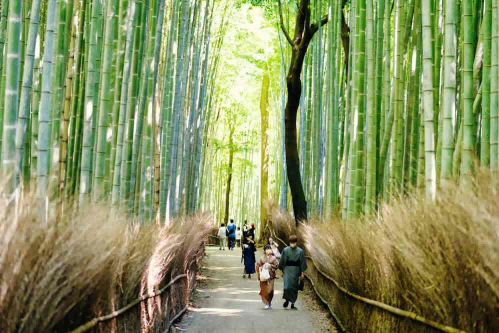
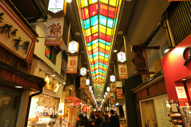
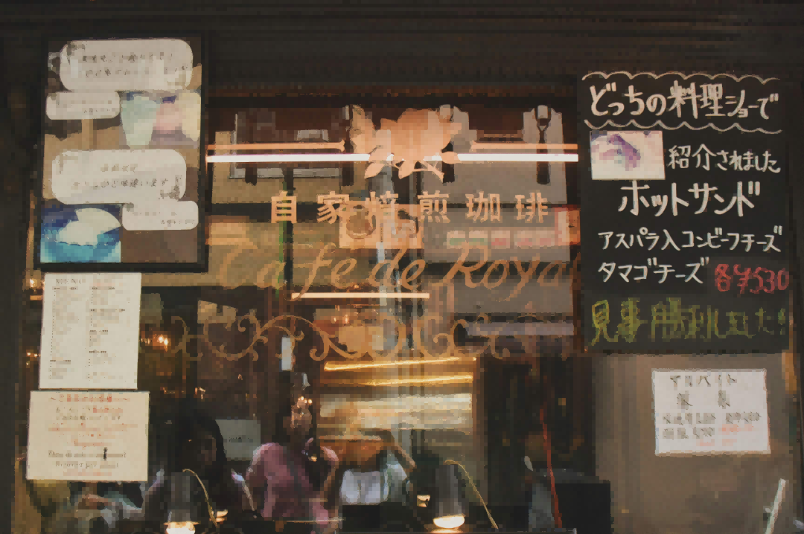
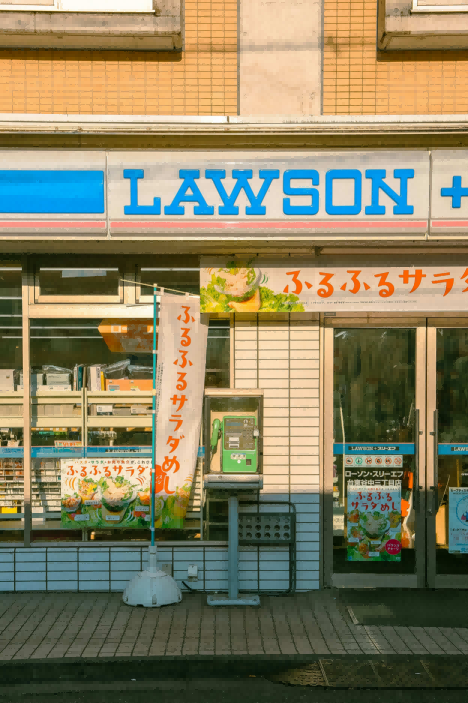
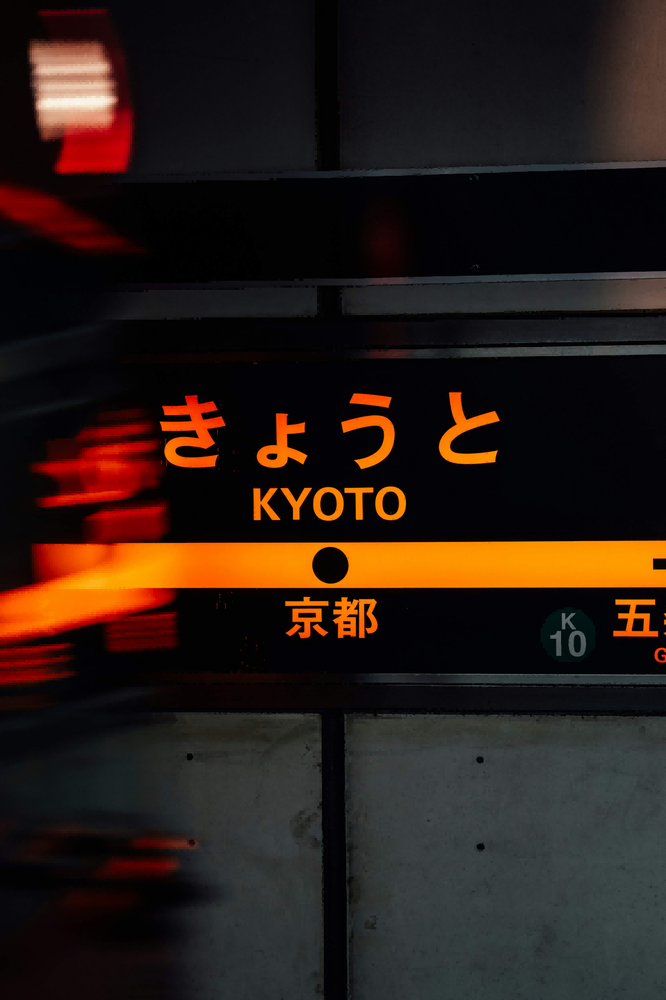

# Quick Guide: Creating Remaining Detail Pages

This guide shows you exactly how to create the 5 remaining detail pages using the Heritage Site page as a template.

---

## 📝 Pages You Need to Create

1. ✅ `heritage-site.html` - **DONE** (use as template)
2. ⏳ `natural-landscape.html` - **TO CREATE**
3. ⏳ `urban-exploration.html` - **TO CREATE**
4. ⏳ `cafe-restaurant.html` - **TO CREATE**
5. ⏳ `supermarket.html` - **TO CREATE**
6. ⏳ `transportation.html` - **TO CREATE**

---

## 🎯 Step-by-Step Instructions

### Creating `natural-landscape.html`

**Step 1: Copy the template**
```bash
cp heritage-site.html natural-landscape.html
```
*Or on Windows: Copy `heritage-site.html` and rename it to `natural-landscape.html`*

**Step 2: Open in text editor**

**Step 3: Make these 3 changes:**

#### Change #1: Update Page Title (line ~6)
```html
<!-- BEFORE -->
<title>Heritage Sites | AKARI KYOTO SHIJO</title>

<!-- AFTER -->
<title>Natural Landscape | AKARI KYOTO SHIJO</title>
```

#### Change #2: Update Background Image (line ~56)
```html
<!-- BEFORE -->


<!-- AFTER -->

```

#### Change #3: Update Container ID (line ~73)
```html
<!-- BEFORE -->
<div class="destination-grid" id="heritage-destinations">

<!-- AFTER -->
<div class="destination-grid" id="nature-destinations">
```

**Step 4: Save the file**

**That's it!** JavaScript will automatically load the correct content.

---

### Creating `urban-exploration.html`

**Copy template:**
```bash
cp heritage-site.html urban-exploration.html
```

**Make 3 changes:**

1. **Page Title:**
```html
<title>Urban Exploration | AKARI KYOTO SHIJO</title>
```

2. **Background Image:**
```html

```

3. **Container ID:**
```html
<div class="destination-grid" id="urban-destinations">
```

---

### Creating `cafe-restaurant.html`

**Copy template:**
```bash
cp heritage-site.html cafe-restaurant.html
```

**Make 3 changes:**

1. **Page Title:**
```html
<title>Cafes & Restaurants | AKARI KYOTO SHIJO</title>
```

2. **Background Image:**
```html

```

3. **Container ID:**
```html
<div class="destination-grid" id="cafe-destinations">
```

---

### Creating `supermarket.html`

**Copy template:**
```bash
cp heritage-site.html supermarket.html
```

**Make 3 changes:**

1. **Page Title:**
```html
<title>Supermarkets | AKARI KYOTO SHIJO</title>
```

2. **Background Image:**
```html

```

3. **Container ID:**
```html
<div class="destination-grid" id="supermarket-destinations">
```

---

### Creating `transportation.html`

**Copy template:**
```bash
cp heritage-site.html transportation.html
```

**Make 3 changes:**

1. **Page Title:**
```html
<title>Transportation | AKARI KYOTO SHIJO</title>
```

2. **Background Image:**
```html

```

3. **Container ID:**
```html
<div class="destination-grid" id="transport-destinations">
```

---

## 📋 Quick Reference Table

| Filename | Container ID | Background Image | Page Title |
|----------|-------------|------------------|------------|
| heritage-site.html | `heritage-destinations` | `heritage-bg.png` | Heritage Sites |
| natural-landscape.html | `nature-destinations` | `nature-bg.png` | Natural Landscape |
| urban-exploration.html | `urban-destinations` | `urban-bg.png` | Urban Exploration |
| cafe-restaurant.html | `cafe-destinations` | `cafe-bg.png` | Cafes & Restaurants |
| supermarket.html | `supermarket-destinations` | `supermarket-bg.png` | Supermarkets |
| transportation.html | `transport-destinations` | `transport-bg.png` | Transportation |

---

## ✅ Verification Checklist

After creating each page, verify:

- [ ] Filename is correct (exact match, lowercase)
- [ ] Page title is updated
- [ ] Background image path is correct
- [ ] Container ID matches the pattern
- [ ] File is saved in the same directory as `index.html`

---

## 🧪 Testing Each Page

**1. Open the page in browser:**
```
Right-click on the .html file → Open with → Chrome/Firefox/Safari
```

**2. Check these things:**
- [ ] Page loads without errors
- [ ] Navigation bar appears
- [ ] Background image shows in hero
- [ ] "Back to Home" link works
- [ ] Destination cards appear (should be 3-6 cards)
- [ ] Google Maps buttons work
- [ ] Language switcher changes content
- [ ] Footer appears

**3. Check browser console (F12):**
- Should have no red errors
- Images should load

---

## ⚠️ Common Mistakes to Avoid

### ❌ Mistake #1: Wrong Container ID
```html
<!-- WRONG - Using same ID as heritage -->
<div class="destination-grid" id="heritage-destinations">

<!-- CORRECT - Use appropriate ID -->
<div class="destination-grid" id="nature-destinations">
```

### ❌ Mistake #2: Wrong Image Path
```html
<!-- WRONG - Typo in filename -->


<!-- CORRECT - Must match exactly -->

```

### ❌ Mistake #3: Forgetting to Save
- Always save after making changes!
- Refresh browser (Ctrl+R or Cmd+R) to see updates

---

## 🎨 Background Images

You need to create/export these background images:

| Page | Image File | Suggested Content |
|------|-----------|-------------------|
| Natural Landscape | `nature-bg.png` | Kyoto gardens, bamboo grove, or river |
| Urban Exploration | `urban-bg.png` | Kyoto shopping streets or city view |
| Cafe & Restaurant | `cafe-bg.png` | Japanese cafe or restaurant interior |
| Supermarket | `supermarket-bg.png` | Japanese supermarket aisle |
| Transportation | `transport-bg.png` | Kyoto train station or bus |

**Image specs:**
- Size: 1920 x 1080px
- Format: PNG or JPG
- Optimize: < 500KB

---

## 💡 Pro Tips

### Tip #1: Use Find & Replace
Instead of manually changing, use your text editor's find & replace:

**Find:** `heritage`
**Replace with:** `nature` (or whatever page you're making)

### Tip #2: Work in Batches
Create all 5 pages at once following the same pattern:
1. Copy file 5 times
2. Rename all 5
3. Open each and make the 3 changes
4. Save all
5. Test all

### Tip #3: Keep Template Clean
Don't modify `heritage-site.html` - keep it as your master template in case you need to create more pages later.

---

## 🔍 What the JavaScript Does Automatically

When your page loads, `detail-pages.js` will:

1. Check which page you're on (by filename)
2. Load the appropriate destination data from the correct language
3. Render all the destination cards
4. Set up Google Maps links
5. Update the hero title and description
6. Handle language switching

**You don't need to do anything else!** Just create the HTML file with the correct container ID.

---

## 📱 Final Test

After creating all pages:

1. **Test navigation from home:**
   - Open `index.html`
   - Scroll to "Around the Area"
   - Click each card
   - Should open the correct detail page

2. **Test language switching:**
   - Switch to Japanese (JP)
   - Navigate to detail page
   - Content should be in Japanese
   - Switch to Chinese (中文)
   - Content should be in Chinese

3. **Test on mobile:**
   - Resize browser window to mobile size
   - Check layout looks good
   - Test hamburger menu

---

## ✨ You're Done!

Once you've created all 5 pages:

- ✅ You have 7 total HTML pages
- ✅ All navigation works
- ✅ Language switching works
- ✅ Google Maps integration works
- ✅ Site is ready for deployment!

**Next step:** Follow the DEPLOYMENT-GUIDE.md to upload your site!

---

## 🆘 Need Help?

**Q: The content doesn't show up on my new page**
- A: Check the container ID matches exactly (case-sensitive!)
- A: Check browser console for errors (F12)

**Q: The background image doesn't show**
- A: Make sure the image file exists in `assets/images/`
- A: Check the filename matches exactly (case-sensitive!)

**Q: The page shows heritage content instead of nature/urban/etc**
- A: You didn't change the container ID - it's still `heritage-destinations`

**Q: Language switching doesn't work**
- A: Clear your browser cache and try again
- A: Check browser console for JavaScript errors

---

**Good luck! Creating these pages should take less than 30 minutes total! 🚀**
